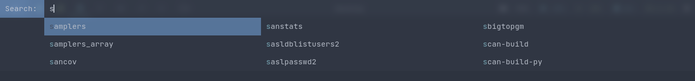

# dmenu - dynamic menu

dmenu is an efficient dynamic menu for X.

`./dmenu-top` is the same config without the center patch.
`./dmenu` is my original dmenu config.

# Requirements

In order to build dmenu you need the Xlib header files.

# Installation

```
cd dmenu
```

or

```
cd dmenu-top
```

Edit config.mk to match your local setup (dmenu is installed into
the /usr/local namespace by default).

Afterwards enter the following command to build and install dmenu
(if necessary as root):

    make clean install

# Running dmenu

See the man page for details.

# Screenshots

### dmenu


### dmenu-top


